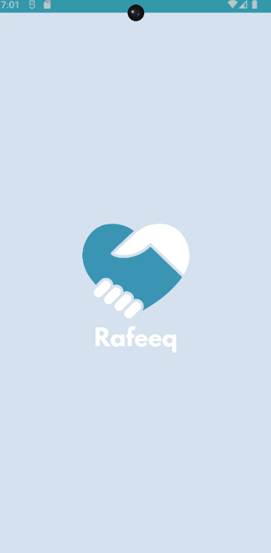
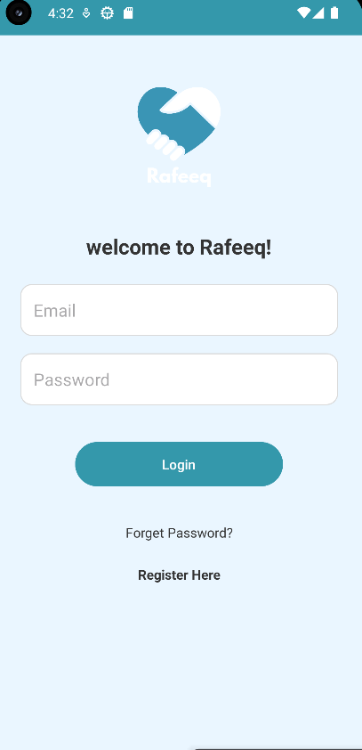
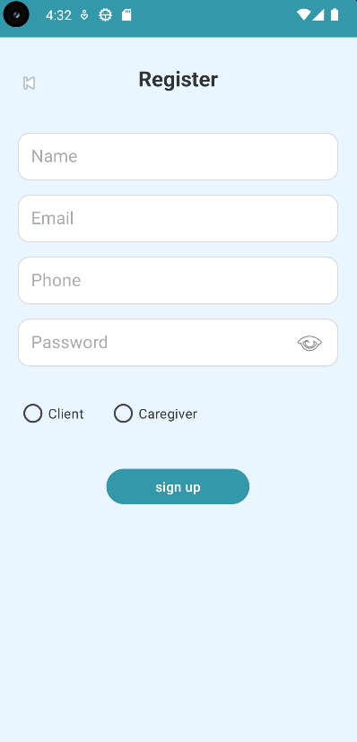

# Rafeeq Healthcare App

## Overview

Rafeeq is an Android healthcare application developed as a *Graduation Project* by a team of five students. The application connects users with caregivers through a simple and user-friendly interface, allowing users to register, log in, browse healthcare services, and book appointments.

The application was built using *Java, **Android Studio, **Firebase Authentication, and **Firebase Cloud Firestore*.

---

## Features

- User Registration
- User Login
- Forgot Password
- Firebase Authentication
- Firebase Cloud Firestore Database
- Browse Healthcare Services
- Caregiver Home Screen
- Appointment Booking
- Splash Screen
- Simple and User-Friendly Interface

---

## Technologies Used

- Java
- Android Studio
- XML
- Firebase Authentication
- Firebase Cloud Firestore
- Gradle

---

## My Contributions

This project was developed by a team of five students, where I served as the *Team Leader*.

My responsibilities included:

- Led the development process and coordinated tasks among team members.
- Designed and implemented the Firebase Cloud Firestore database.
- Implemented Firebase Authentication.
- Developed the Login screen.
- Developed the Registration screen.
- Implemented the Forgot Password feature.
- Developed the Caregiver Home screen.
- Created the Splash Screen.
- Integrated Firebase services with the Android application.

---

## How to Run

1. Clone or download this repository.
2. Open the project using Android Studio.
3. Create your own Firebase project.
4. Add your own google-services.json file inside the app folder.
5. Sync Gradle.
6. Build and run the application.

---

## Project Structure

- app/ – Android application source code
- gradle/ – Gradle configuration
- build.gradle.kts – Project build configuration
- settings.gradle.kts – Project settings
- gradle.properties – Gradle properties

---

## Screenshots

### Splash Screen

### Login

### Register

### Caregiver Home

## Note

For security reasons, the google-services.json file is *not included* in this repository.

To run the application, create your own Firebase project and place your own google-services.json file inside the app directory.
